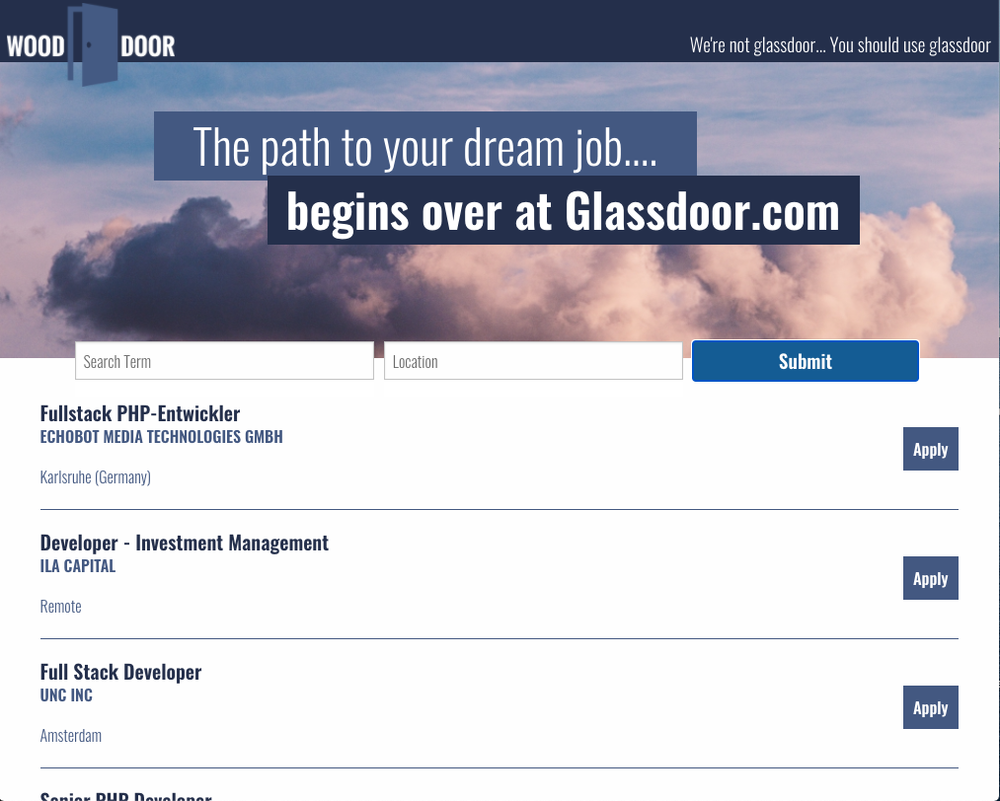

# Allison_Barnard_Portfolio
 
Updated portfolio to show how far I have come since the beginning of CWRU's Coding Bootcamp.
 
Preview: 
 
Added Project 1 - the last project done to display group work, JS, HTML, JQUERY, AJAX, and CSS. 
 
Preview: 
 
Added password generator to display JS skills and responsiveness.
 
Preview: 
 
Added first homework of a website clean up (this was before I knew Media Queries) to show how far I have come in responsiveness for apps. 
 
Github: https://github.com/allisonbarnard07/Allison_Barnard_Portfolio
 
Site: 
